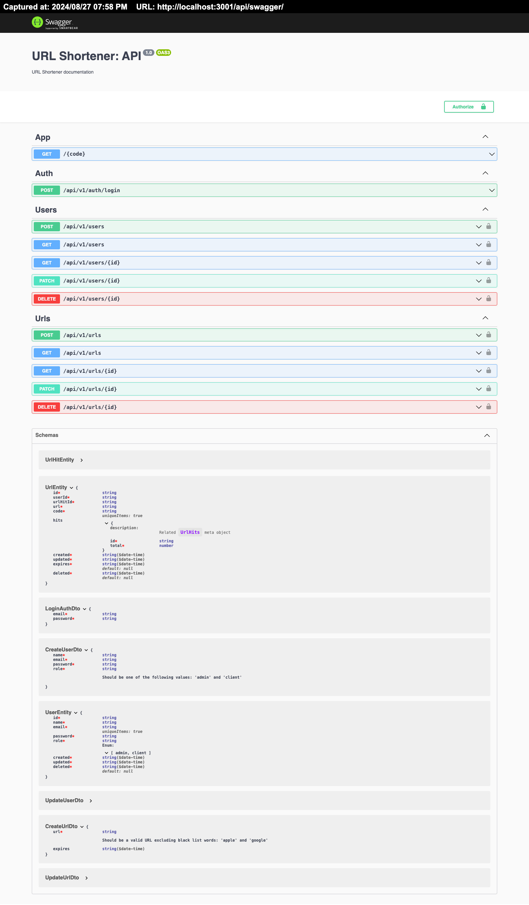

# README

## URL-Shortener

A URL-shortener service that makes long, unwieldy URLs more manageable and shareable.

### Key Features

- Quickly generate short, unique links for any URL.
- User authentication and authorization for managing and tracking personal short links.
- Allow users to set expiration dates for shortened URLs, after which they would be automatically deleted.
- Customizable short links (optional, depending on implementation).
- Track click statistics for shortened links.
- Easy integration into your projects.

### Tech Stack

- Built with [NestJS](https://nestjs.com/), a powerful Node.js framework for building efficient and scalable server-side applications.
- Leverages [Node.js](https://nodejs.org/) for fast and reliable performance.
- Uses [MongoDB](https://www.mongodb.com/) as the database for storing URL mappings and click data, providing flexibility and scalability.

### Future Improvements

- Add support for custom domain names for shortened URLs.
- Explore caching mechanisms for frequently accessed short links to improve performance.
- Protect the service from abuse by implementing rate limiting on API endpoints.

## Installation

```bash
# install
$ npm install
```

## Running the app

```bash
# development
$ npm run start

# watch mode
$ npm run start:dev

# production mode
$ npm run start:prod
```

## Test

```bash
# unit tests
$ npm run test

# e2e tests
$ npm run test:e2e

# test coverage
$ npm run test:cov
```

## Husky

This project uses [Husky](https://typicode.github.io/husky) to manage Git hooks, ensuring that your code meets quality standards before committing.

### Pre-Commit Hook

The Husky pre-commit hook is configured to run the following tasks automatically before each commit:

1. **Code Formatting**: Runs `Prettier` to format your code according to the project's style guidelines.
2. **Linting**: Runs `ESLint` to catch and fix any potential issues in your TypeScript code.

These tasks are defined in the `lint-staged` configuration, which targets files with specific extensions (e.g., `.ts`, `.scss`, `.json`, `.md`) within the `src` directory and non-`node_modules` directories.

If any of these tasks fail, the commit will be aborted, and you'll need to fix the issues before trying to commit again. This ensures that only properly formatted and linted code is committed to the repository.

### Manual Testing

In addition to the automated checks, you can manually run the following scripts to ensure your code meets the standards:

```bash
# Format code
$ npm run format

# Lint code
$ npm run lint
```

## Environment variables

In order to run the project, first the environment variables should be configured by coping content of file `.env-template` to a new `.env` and edit it

## Swagger

Swagger can be enabled in the `.env` file by setting `APP_API_IS_SWAGGER_ENABLED=true`.

Once enabled and running in the development environment, you can visit the Swagger UI at:
[http://localhost:3000/api/swagger/](http://localhost:3000/api/swagger/)

### Swagger Documentation

The API documentation for the URL Shortener service is provided via Swagger. It offers an interactive interface to explore the available endpoints, test their functionality, and view detailed information about the request and response models.


